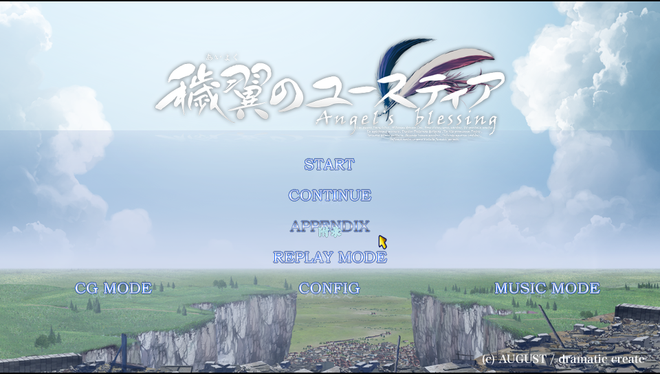
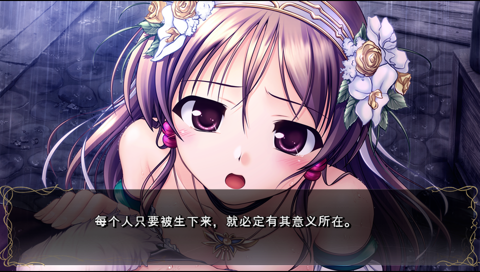
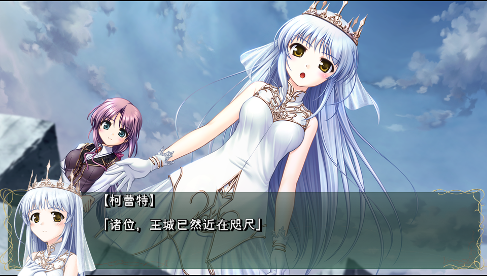
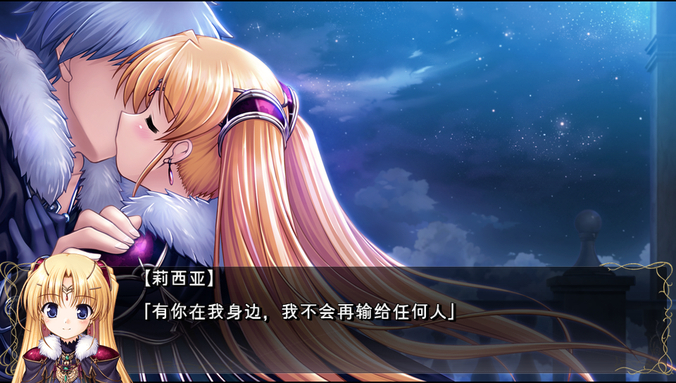
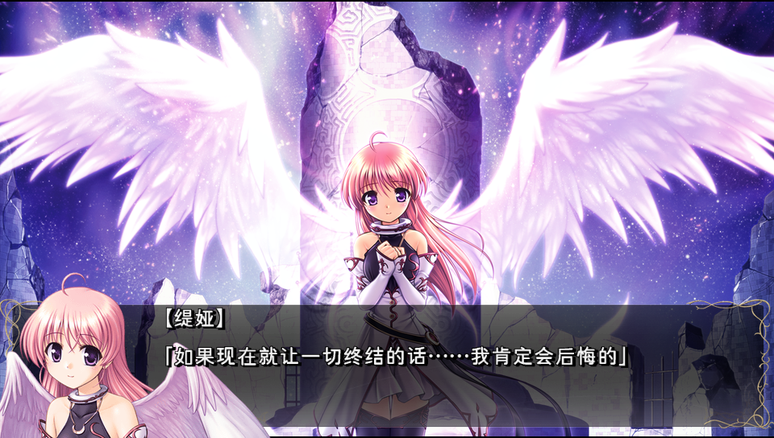
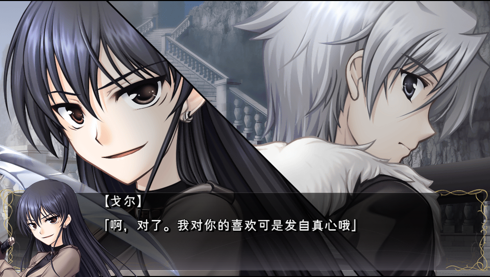
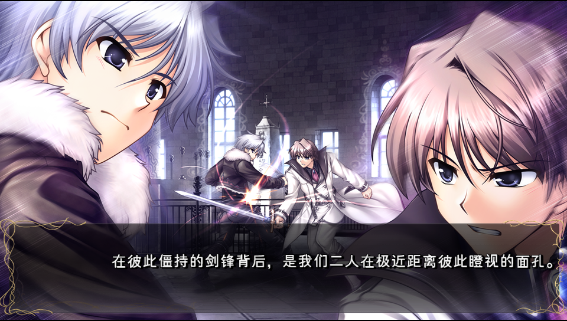
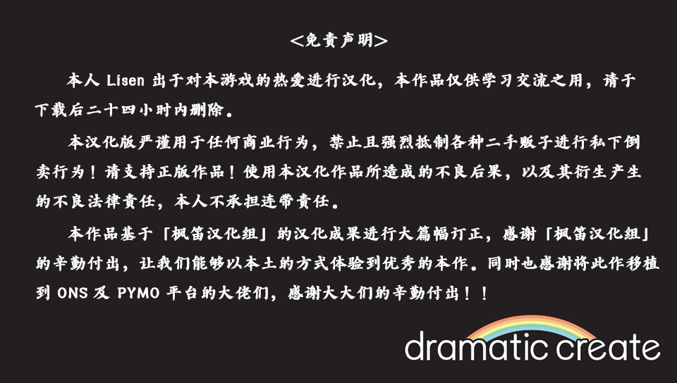

## Vita Eustia Process Tool

* PSVita《秽翼的尤斯蒂娅》游戏数据包汉化工具库

-----


[English](README) • 中文版

----

### 成果展示









-----

## 工具使用说明

### mrg 文件数据提取 & 重新打包使用方法
```shell
# 解包 *.mrg 文件
# 脚本会自动解析与 .mrg 文件配套的 .nam & .hed 三元组文件（三选二, mrg 必须）, 亦或是单独的 mrg 文件
python3 mrg_extract_tool.py unpack allpac.mrg


# 将目标文件夹重新打包为单 .mrg 文件
python3 mrg_extract_tool.py repack --list [dir_name]/list.txt dir_name output.mrg


# 将目标文件夹重新打包为 .mrg, .nam, .hed 三元组文件
python3 mrg_extract_tool.py repack --list [dir_name]/list.txt dir_name output.mrg --with-hed
```

### mzp 文件数据提取 & 重新打包使用方法
```shell
# 解包单 *.mzp 文件（支持常规的 png 格式图片, 含索引图[Index]、8、24、32[RGBA] 位图）
# 会自动创建 mzp-unpacked 文件夹存储产物
# 产物包括提取后的 png 文件 和一个 json 配置文件（该配置用于重新打包回 mzp 文件）
python3 mzp_extract_tool.py unpack *.mzp

# 解包目标文件夹内所有的 *.mzp 文件, 解包产物同上
python3 mzp_extract_tool.py unpack [dir_name]

# 将指定 png 文件重新打包为单 .mzp 文件
# 工具会自动寻找与 png 同名的 json 配置文件辅助打包
python3 mzp_extract_tool.py repack *.png

# 将指定文件夹内的所有 png 文件重新打包为对应的 .mzp 文件
# json 配置文件同上
python3 mzp_extract_tool.py repack [dir_name]
```

### 处理游戏脚本文件（翻译目标）
```shell
# 1. 先使用 mrg_extract_tool 提取 allscr.mrg 文件
# 产物会生成一堆 *.mzx 文件
python3 mrg_extract_tool.py unpack allscr.mrg

# 2. 使用 scr_tool 转换目标文件夹下 *.mzx => *.scr
# *.scr 文本编码为 CP932, 文件内是脚本指令及原始日语文案
python3 scr_tool.py unpack [dir_name]

# 3. 修改日语为目标语言
# ① 译文对照表为 game_script/translate.csv 文件 (日文原文, 中文译文)
# ② eboot 译文对照表为 eboot/translate-info.csv 文件 (日文原文, 中文译文)
# ③ 使用 script_compare.py 工具会自动分析上述两个译文对照文件, 生成 glyphTable/translate-character.txt 字符表文件
# ④ 使用 character_to_glyph_table_tool.py 工具, 则会自动根据 glyphTable/translate-character.txt 字符表文件
# 创建对应的四套字形图 png 产物及字符映射文件(glyphTable/character-mapping.json)
# ⑤ 修改对应译文对照表中的第二列, 即可修改对应的中文展示文案
# ⑥ 使用 apply_translate_to_scrs.py 工具, 会自动将译文按照对应的字符映射关系生成翻译后的 *.scr 产物(默认输出在 game_script/psv/translated 文件夹下)
# ⑦ 使用 scr_tool 将 *.scr => *.mzx 重新打包成 *.mzx 文件
python3 scr_tool.py respack [dir_name]

# 最后再用 mrg_extract_tool 将修改后的 mzx 重新打包回 allscr.mrg 文件即可
```

### 处理 eboot 硬编码文案
```shell
# 将 eboot/translate-info.csv 翻译对照文件应用到 eboot 中
# 产物为 eboot/device/eboot_patched.elf 文件
# 最后再将 elf 重新打包回 eboot.bin 即可(实机需要还原签名, 具体参照 restore_eboot_auth_tool.py)
python3 modify_eboot_hardcode_text_tool.py
```

### 封回翻译后字形图
```shell
# 该工具会自动根据 glyphTable/translate-character.txt 字符表文件生成对应的 png 字形图
# 将 png 产物使用 mzp_extract_tool 重新打包成 *.mzp 文件
# 替换原始 mzp 文件后, 重新打包回 mrg 字库文件即可
python3 character_to_glyph_table_tool.py
```

### 备注
本项目仅为 PSVita 版《秽翼的尤斯蒂娅》一款游戏服务, 不支持其他 HuneX 引擎的游戏, 仅提供汉化方向指引用于学习交流, 如果想对 HuneX 引擎做更多深入的了解, 可参照 [【Hintay】PS-HuneX_Tools](https://github.com/Hintay/PS-HuneX_Tools) 和 [【root-none】PS-HuneX_Tools-CN](https://github.com/lzhhzl/PS-HuneX_Tools-CN) 两个项目, 他们是专为 HuneX 引擎研究而设计的。

> 本项目并未考虑关键选择支剧情文案超长的问题，HuneX 引擎的剧本超长具体可查阅 [【root-none】hunex引擎汉化分析笔记(3)](https://root-none.pages.dev/#/localization_notes/Hunex_Engine/note_hunex_3) 大佬文章中的说明，按照对应规则即可实现任意长度。

### 免责声明&抵制


-----

## 特别鸣谢

[PS-HuneX_Tools](https://github.com/Hintay/PS-HuneX_Tools)

[mahoyo_tools](https://github.com/loicfrance/mahoyo_tools)

[deepLuna](https://github.com/Hakanaou/deepLuna)

[PSV_WHITE_ALBUM2](https://github.com/wetor/PSV_WHITE_ALBUM2)

> 没有上述开源项目作者们的辛勤付出，就没有本作品的企划和成果，再次感谢上述大佬们的贡献！！！